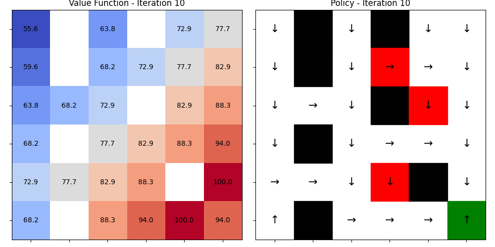
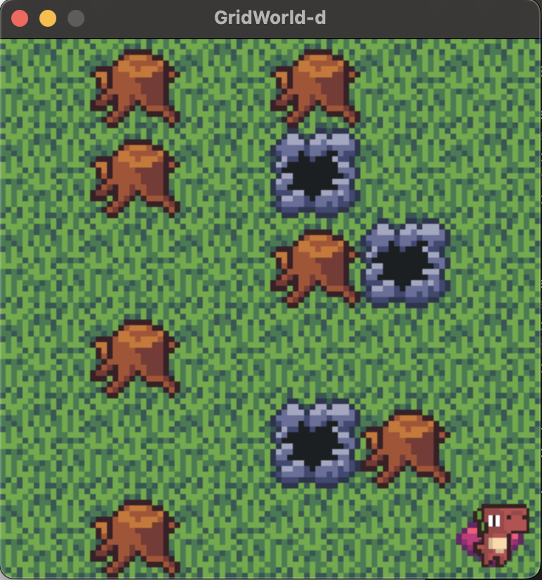

## Lab 1. Dynamic Programming
This provides an introduction to fundamental Dynamic Programming concepts tested on a discrete GridWorld environment.
Implemented algorithms include:

- **Policy Iteration**
- **Value Iteration**

---

### GridWorld Environment

The GridWorld environment is a 2D grid-based world where each cell can be one of the following types:

- 🟩 **Normal**: The agent can move to a normal cell with a reward of -1.
- 🧱 **Wall**: The agent cannot move into a wall cell. The agent stays in its current position and receives a reward of -1.
- ☠️ **Trap**: If the agent moves into a trap cell, it receives a reward of -100, and the episode ends.
- 🎯 **Goal**: If the agent reaches the goal cell, it receives a reward of 100, and the episode ends.

#### Grid Dimensions

- The grid size can range from **5x5** to **10x10**.

#### Actions

- The agent has 4 possible actions:  
  - ⬆️ **Move Up**  
  - ⬇️ **Move Down**  
  - ⬅️ **Move Left**  
  - ➡️ **Move Right**

---


### Training 
To train an RL agent, run the `train.py` script with the desired algorithm and optional arguments.
```bash
python train.py --algo {algorithm} [--map_size SIZE] [--save_name]
```
**Arguments**
- --algo (str, required): Choose the learning algorithm.
  - Options: pi, vi
- --map_size (int, optional): Width & Height of the GridWorld. Default is 6. (Range should be 5-10)
- --save_name (str): Filename to save the policy.

**Parameter Arguments**
You can adjust the parameters for training with additional arguments
- --gamma (float): Gamma values. Default is 0.95
- --max_iteration (int): Max iteration number. Default is 80.
- --theta (float): Theta values. Default is 1e-3.

**Save**
The trained policy will be saved as `checkpoints/policy_{args.algo}_{args.save_name}.pkl`.

The visualization of the value function and policy for each iteration are saved in `output/{args.algo}_{args.save_name}/` folder. In this visualization, 
  - Red: Trap
  - Black: Wall
  - Green: Goal 
  - White: Normal

---

### Rendering a Trained Policy
You can visualize a learned policy using the `render.py` script:
```bash
python render.py --policy {path_to_policy.pkl} [--map_size SIZE] [--random]
```
**Arguments**
- --policy (str, optional): Path to a .pkl policy file. (should provide as `policy_{algo}_{save_name}.pkl` format) If omitted, agent would act randomly.
- --map_size (int, optional): Grid size (default 6). Range should be 5-10.
- --random (flag): Use a randomly generated map instead of a fixed one.

This will render the agent's behavior following the trained policy in the GridWorld environment.

---

### Example Script
#### Policy Iteration
```bash
# training
python train.py --algo pi --map_size 6  --save_name test
# rendering
python render.py --policy policy_pi_test.pkl --map_size 6
```

#### Value Iteration
```bash
# training
python train.py --algo vi --map_size 6  --save_name test
# rendering
python render.py --policy policy_vi_test.pkl --map_size 6
```

After training, the visualization would be saved in `/output/{args.algo}_{args.save_name}` as like the following example:



After running the rendering script, a window with the following visualization would appear:

